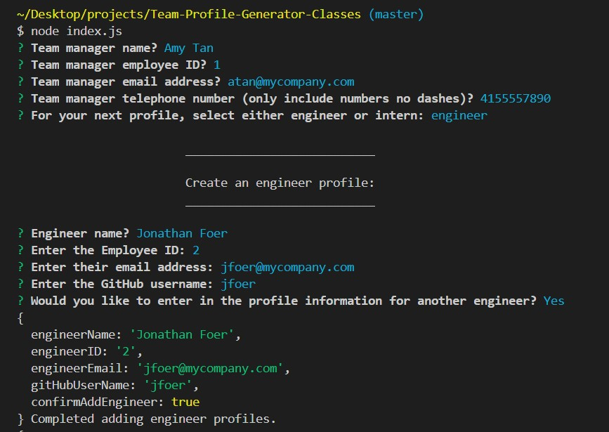
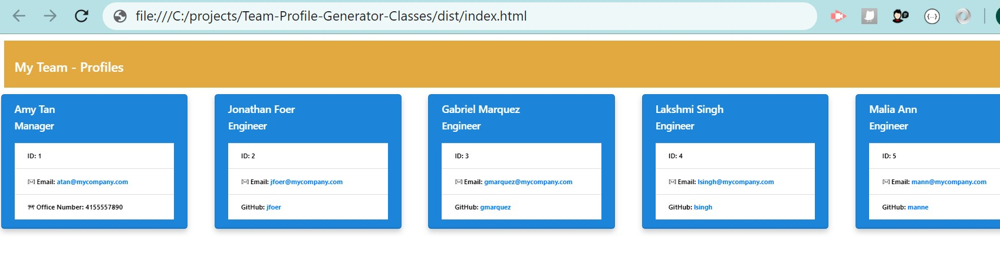
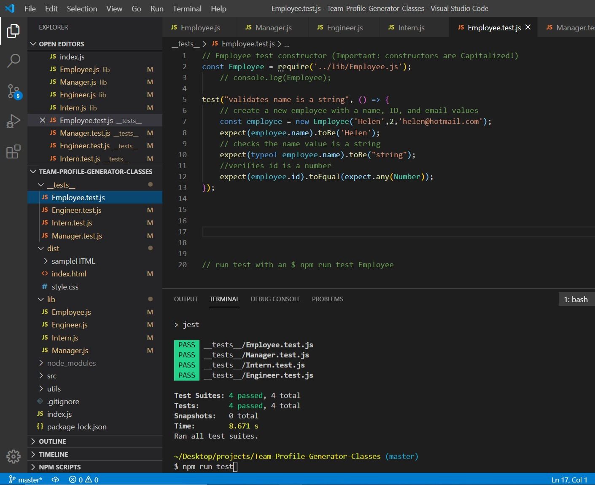

# Repository: Team-Profile-Generator

## GitHub 
https://github.com/ktrnthsnr/Team-Profile-Generator

## Table of Contents
* [Description](#description)
* [Installation](#installation)
* [Usage](#usage)
* [Reference](#reference)
* [Testing](#testing)
* [Technology](#technology)
* [Contribution](#contribution)

## Description
This is a Node.js command-line application requesting user input on employees, and then generates an HTML webpage that displays summaries for each person. Unit testing through Jest is included.

## Installation
- Prereq: install VSCode, Node.js
- After cloning the GitHub repo to your local drive, run the following in the VSCode terminal command-line
- $ npm init
- Install npm Inquirer, for more info https://www.npmjs.com/package/inquirer
- $ npm install inquirer
- Install npm Jest, more info https://jestjs.io
- $ npm install --save-dev jest
- Update package.json from "test": "test" to "test": "jest" 
- Create a .gitignore file in the root and add node_modules to this file
- If you need to re-add the dependencies, run $ npm install

## Usage and User Responses
* From your terminal, invoke\start the application by running 
* $ node index.js
* Here is a sample of user questions and responses

* The output file will be written to the /dist folder. Here is sample index.html created by the app 

* Sample HTML in browser

* Here is a walkthrough of the usage: test, start app, sample user responses, and HTML output.
https://drive.google.com/file/d/1_ayYhr_GL1fjUY6UZFSb_MGJnlVgvMeB/view

## Reference
mod10

## Testing
Run Jest within the VSCode terminal, $ npm run test

## Technology
Node, JavaScript, ES6, HTML, CSS, Jest, npm, npm Inquirer

## Contribution
ktrnthsnr

### ©️2020 ktrnthsnr
